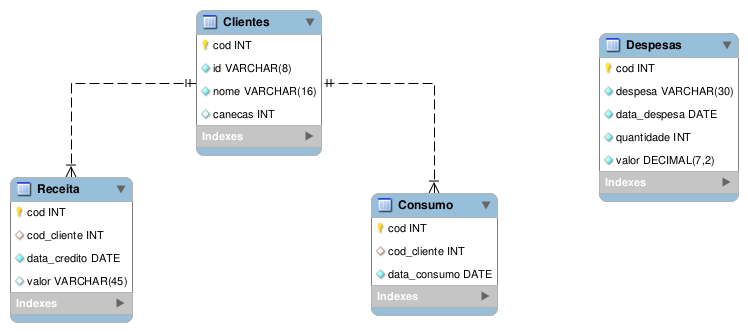

# Autosserviço de bebidas - Banco de dados

Protótipo de um sistema de autosserviço de bebidas, baseado em crédito para o usuário, com tag de identificação. Integrado com um sistema de gestão para o proprietário.

O fluxo de funcionamento consiste em o cliente cadastra-se no caixa a sua tag ID, e a partir desse cadastro realizar a compra dos créditos. O cliente ficaria em posse dessa tag, e poderá se servir de forma autônoma em um dos dispensers, desde que possua os créditos. Dessa forma, o equipamento proporcionará agilidade para o cliente e automação para o negócio. 

O Sistema de dispenser por meio de um módulo RFID, realizará uma consulta ao banco de dados, que por sua vez, retorna o nome do usuário, e seu respectivo crédito no display, e no caso do usuário não possuir créditos, impedir o fornecimento da bebida. O sensor de fluxo identifica a quantidade de líquido consumida em ml, e em quanto atingir o limite estabelecido interrompe o fornecimento e atualiza o crédito do usuário.

O sofware de gestão do proprietário, tem o objetivo de entregar um balancete do estabelecimento, para facilitar a gestão e controle do estabelecimento, por meio de uma aplicação web, assim permitindo que o gestor acessar remotamente. O sistema apresenta quatro áreas de informações, sendo elas: Balanço geral do estabelecimento; Vandas realizadas no caixa; Consumo dos usuários no dispenser; e o registro das despesas do estabelecimento. 

Esse repositório destina-se ao *dispenser* do protótipo, o projeto deve ser executado junto com os seguintes repositórios: 
- Dispenser: https://github.com/guilhermesetim/selfservice-bebidas-dispenser
- Caixa:
- Software de gestão:

## Banco de dados
O banco de dados é o responsável pela viabilidade de todo o sistema, pois com os registros que são gravados nele, permite a consulta que os três sistemas necessitam.

O banco utilizado no projeto foi o MySql, banco de dados relacional que suporta a linguagem SQL para realizar as consultas e registros no banco de dados. Devido as necessidades do projeto, o MySql foi o banco de dados escolhido pois precisa suportar o modelo entidade relacionamento, modelo utilizado no banco de dados escolhido e ser compatível com as linguagens Python e Php.

## Como executar o projeto
Necessário possuir o MySql instalado.

O arquivo script_create_bd.sql destina-se a criação do banco de dados pronta atendero projeto como um todo. A execução do script pode ser realizada por meio do terminal com o mysql, ou por uma ferramenta de administração de banco de dados MySql como o MySQL Workbench.

# Autor
Guilherme Setim
